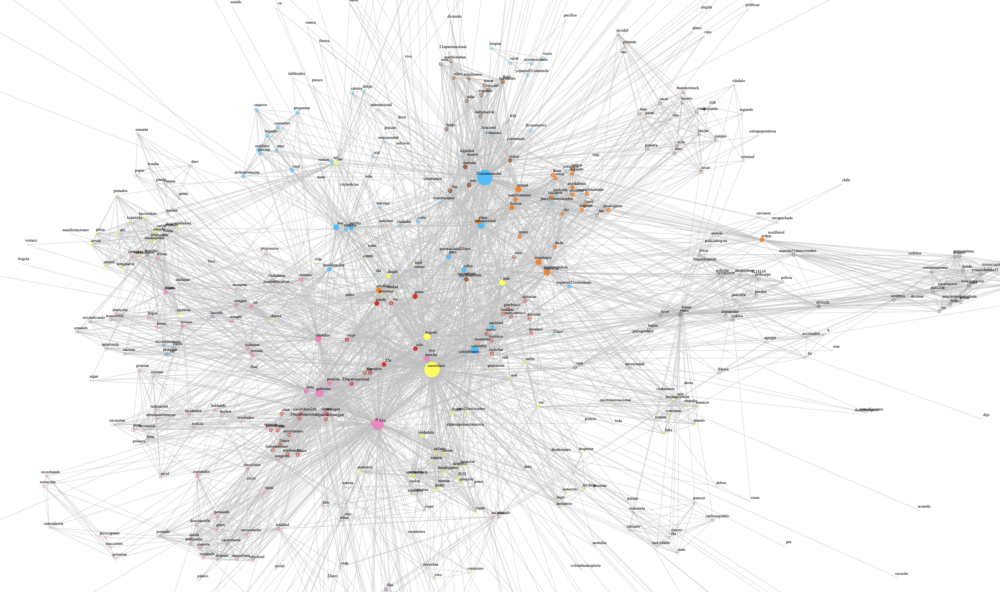
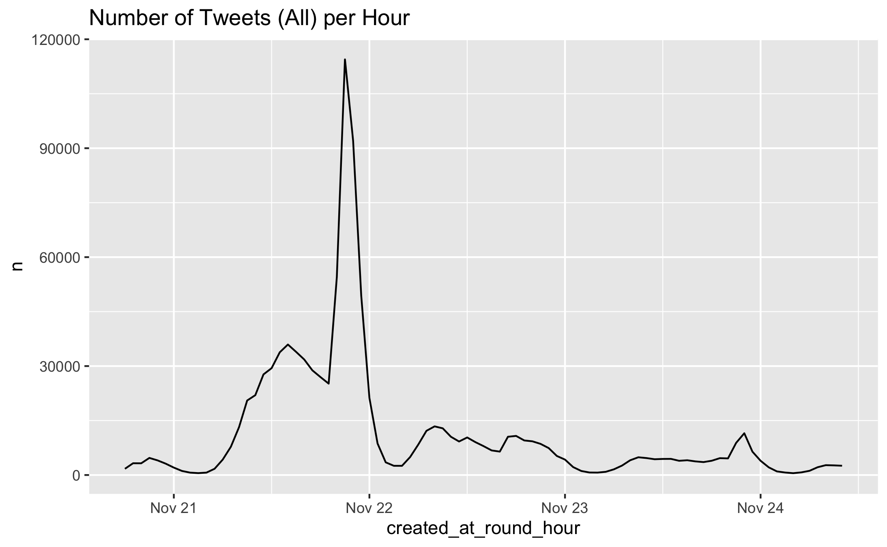

# Twitter Analysis: [21N Colombia](https://es.wikipedia.org/wiki/Protestas_en_Colombia_de_2019-2020)

## Description:

Twitter Analysis from the 21N (21-November-2019) protests in Colombia (Work In Progress!).



## Data Source:

We used the [`rtweet`](https://github.com/ropensci/rtweet) [R](https://www.r-project.org/) package to fetch a sample of tweets during the protests period. We tried to cover a large topic spectrum via the following keywords:
```R
  "21N", 
  "#21N", 
  "#21NSomosTodos",
  "#Paro21N", 
  "#YoMarchoEste21",
  "#YoMarchoEl21",
  "#YoNoMarchoEste21",
  "#YoNoMarchoEl21",
  "#RazonesParaMarchar",
  "#RazonesParaNoMarchar",
  "#100RazonesParaMarchar", 
  "#100RazonesParaNoMarchar", 
  "#YoNoParo",
  "#YoParoEl21NSinMiedo", 
  "#Cacerolazo", 
  "#22N", 
  "#23N",
  "#ToqueDeQueda"
```
[Here](https://github.com/juanitorduz/twitter_analysis_21n/blob/master/data_fetching/get_twitter_data.R) is the script we used to fetch the data. The sample data is stored as an `.rds` file. Our dataset contains 1006484 tweets.



## Analysis Status

In this repository you can find some data pre-processing and initial exploratory data analysis: word counts, topic modeling and network (retweet) analysis.

Despite the fact we have not had the capacity to dig deeper into the analysis, we still believe there is very interesting insights to be extracted from this data. 

If you would like to have access to the data and/or contribute to this repository do not hesitate to [contact us](mailto:juanitorduz@gmail.com).

## Set Up

We assume the data is stored in the `data` folder. 

## Data Processing

```bash
Rscript R/data_processing.R
```

## Testing 

```r
testthat::test_dir(path = "tests/")
```


